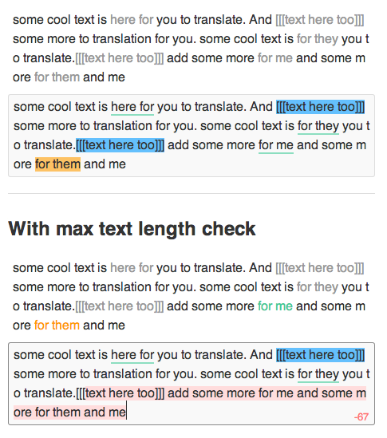

jquery.textarea-highlighter.js
==============================

jQuery plugin for highlighting text in textarea

#DEMO

- [DEMO](http://marexandre.github.io/jquery.textarea-highlighter.js/demo/ "DEMO")
- [DEMO with debug](http://marexandre.github.io/jquery.textarea-highlighter.js/demo/test.html "DEMO with debug")


# Screen Shot


# Usage

This is the basic usage in javascript:

```javascript
// can be a class too $('.someElement')
$('#someElement').textareaHighlighter({
    matches: [
        {
            'match': ['this is a test', 'text to match'], // will check for this matches
            'matchClass': 'match'                         // on matched text this class will be added
        },
        {
            'match': ['some', 'more', 'here'],
            'matchClass': 'someClass'
        },
        {
            'match': /\{\/?\d+\}/g,
            'matchClass': 'tags'
        }
    ]
    maxlength: 150,
    maxlengthWarning: 'warning',
    maxlengthElement: $('#someElement').find('.maxlength')

});
```

This is the basic using with data- in HTML:

```html
<textarea data-maxlength="150" data-debug="true"></textarea>
```

# Events

### textarea.highlighter.init.complete
This is triggered when plugin's initialization is complete.

```javascript
$('#someElement').on('textarea.highlighter.init.complete', function(){
    // do some cool stuff :)
});
```

### textarea.highlighter.update
Event triggered when a matching text is found

```javascript
$('#someElement').on('textarea.highlighter.update', function(e, data){
    // data -> {'textList': []}
    // textList is an arry with matched text
});
```

### textarea.highlighter.destroy
Remove all added HTML/CSS and plugin related event bindings etc..

```javascript
$('#someElement').trigger('textarea.highlighter.destroy');
```

### textarea.highlighter.debug.on
Turn debug mode on

```javascript
$('#someElement').trigger('textarea.highlighter.debug.on');
```

### textarea.highlighter.debug.off
Turn debug mode off

```javascript
$('#someElement').trigger('textarea.highlighter.debug.off');
```

# Options

These are the supported options and their default values:

```javascript
$.textareaHighlighter.defaults = {
    isCustomeCss: false,     // Set to 'true' if you prefer to use minimal css added with the plugin
    matches: [               // Array of matches with matchClass & word array
    //    {
    //        'matchClass': 'match',
    //        'match': ['a','b'] or RegExp
    //    }
    ],
    maxlength: -1,           // -1: disable, some int number over 0
    maxlengthWarning: '',    // Class name to add to text when it's over max length
    maxlengthElement: null,  // jQuery element to update letter count in the view
    debug: false,            // Flag to show debug mode
    typingDelay: 30          // Typing delay in milliseconds
};
```

# Tested

- Chrome 30+, FireFox 24+ (OSX & PC)
- Latest Safari & Chrome for ios 7+
